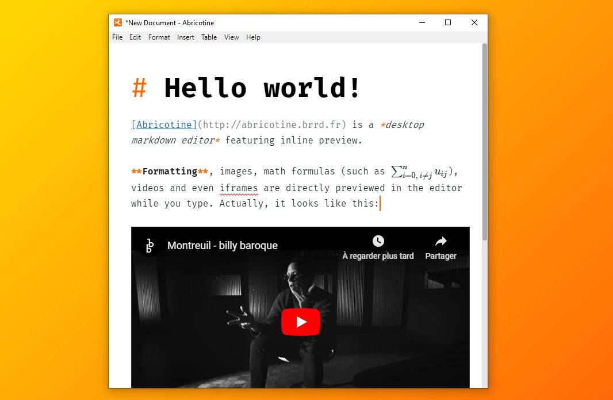
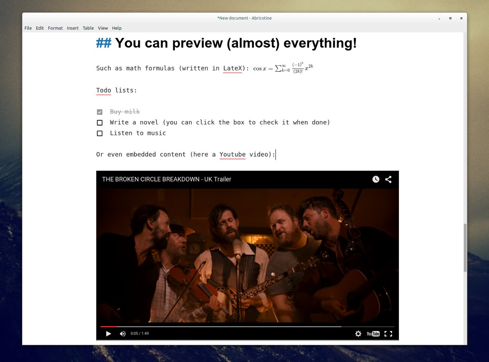

# Abricotine

> A markdown editor for desktop



In **Abricotine**, you can preview your document directly in the text editor rather than in a side pane. 



**Abricotine** is an [open-source software](LICENSE.txt) based on modern web technologies (HTML5, CSS3 & Node.js).

## Features

* Write in markdown (or GFM) and export your documents in HTML,
* Preview text elements (such as headers, images, math, embedded videos, todo lists...) while you type,
* Display document table of content in the side pane,
* Display syntax highlighting for supported languages (HTML, XML, CSS, Javascript, and more to come...),
* Show helpers, anchors and hidden characters,
* Copy formated HTML in the clipboard,
* Write in a distraction-free fullscreen view,
* Manage and beautify markdown tables,
* Search and replace text,
* And more features to come...

Abricotine is still in beta development. If you find a bug please report it [in the dedicated bug tracker](https://github.com/brrd/Abricotine/issues). 

## Supported platforms

Abricotine is currently working on Windows and Linux. 

Since the app is developed [on top of modern web technologies](http://electron.atom.io/), the OSX support is in theory possible and should be relatively easy to add. As a Linux user I'm not planning to develop this feature, but of course your Pull Requests are welcome and encouraged!

## Installation and usage

Installers are not released yet. 

To install Abricotine:

1. First, download and install [Node.js](https://nodejs.org/en/),
2. Download [the latest Abricotine release](https://github.com/brrd/Abricotine/releases) and extract the downloaded archive wherever you want to install the application on your computer,
3. Run `$ npm install` in the extracted folder.
4. Install is done! To use Abricotine, run `$npm start` from Abricotine directory. To open a specific file, run `$npm start -- [path-to-file]`.

## Configuration

You can open and edit Abricotine `JSON` configuration file by clicking "Edit preferences" in the "Edit" menu. 

Most of the configuration entries are already handled by menus so you do not need to edit a file for changing them. However there is no menu for editing the following options:

### `autopreview-security`

If set to `true`, only iframes loaded from domains listed in `autopreview-domains` will be previewed.

Default is `true`.

### `autopreview-domains`

Contains the list of domains considered as safe when previewing iframes (see `autopreview-security`).

Default:

```
 "autopreview-domains": [
     "dailymotion.com",
     "deezer.com",
     "dribbble.com",
     "facebook.com",
     "github.com",
     "google.com",
     "instagram.com",
     "pinterest.com",
     "soundcloud.com",
     "spotify.com",
     "twitter.com",
     "vimeo.com",
     "youtube.com"
]
```

## Adding spell checker dictionaries

Abricotine uses [hunspell](http://hunspell.sourceforge.net/) dictionaries for Linux and Windows 7 and prior. If you want to add dictionaries, simply drop the dictionary folder in the `dict` subdirectory of Abricotine configuration folder.

On the other platforms, Abricotine uses the OS builtIn dictionaries.

## License

**Abricotine - Markdown Editor**  
**Copyright (c) 2015 Thomas Brouard**

This program is free software: you can redistribute it and/or modify it under the terms of the GNU General Public License as published by the Free Software Foundation, either version 3 of the License, or (at your option) any later version.

This program is distributed in the hope that it will be useful, but WITHOUT ANY WARRANTY; without even the implied warranty of MERCHANTABILITY or FITNESS FOR A PARTICULAR PURPOSE.  See the GNU General Public License for more details.

You should have received a copy of the GNU General Public License along with this program.  If not, see <http://www.gnu.org/licenses/>.
